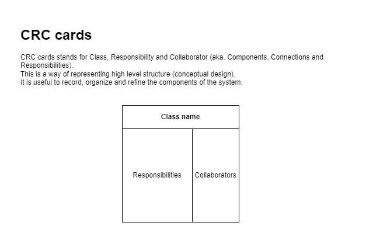
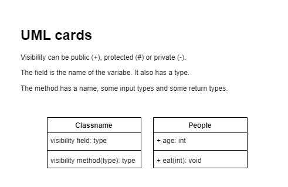
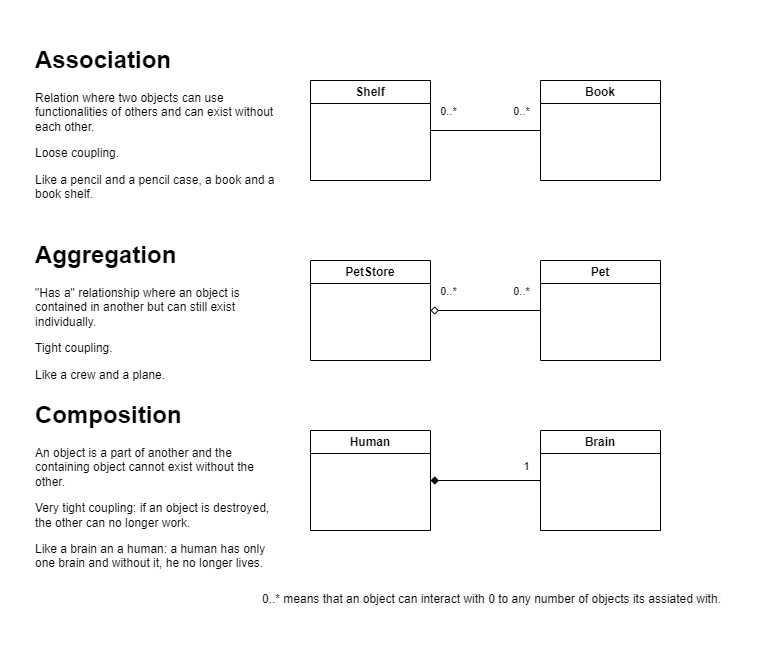
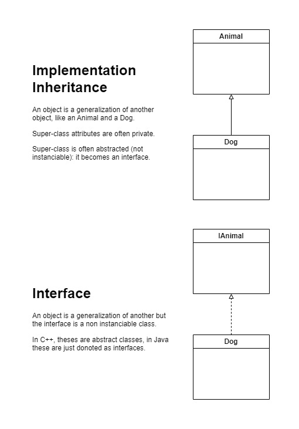
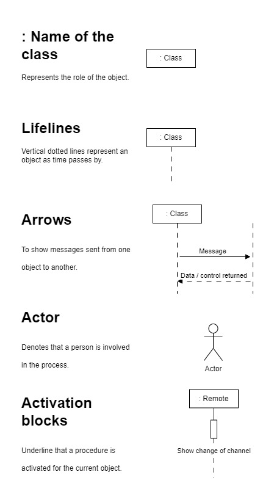
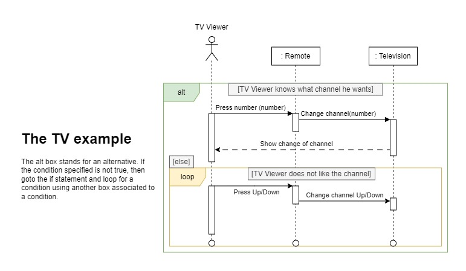
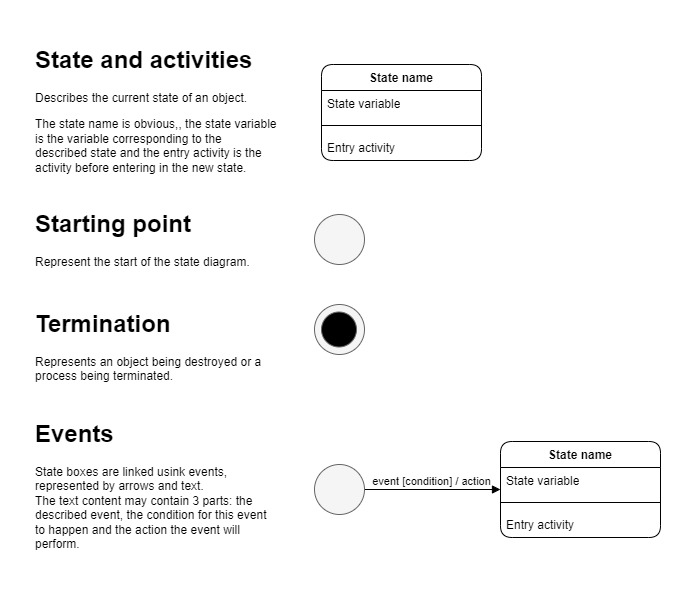
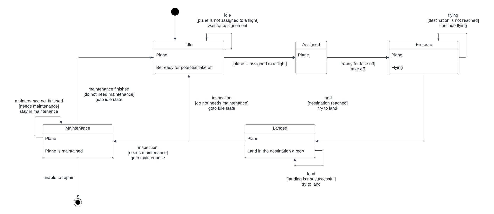

# Software Architecture

## Introduction to software architecture

!!! success "The objectives of software design is to make the code:"
    - Flexible
    - Reusable
    - Maintainable

What is the difference between software design and software architecture?
It depends on the size of the company: both roles can be merged sometimes.
Some say that it is the same problem at a different scale.

Required skills:

- Problem understanding through:
    - Technical expertise (keep reading)
    - Communication (with engineer, clients, developer, etc...)
- Project planning
- Forward problem solution
- Creativity

Design and architecture is important if you want to have a stable, long- lived system. Anybody can build a system that'll last a week or a month or a year, but if you want to build something that is the basis of other people's work and contribution over potentially a period of years or longer, in some cases, you need to put some thought into it. You need to have somebody whose job it is to look out for the long game and make sure that you are not making suboptimal short term decisions.

For small designs, it is just some brainstorming on a whiteboard.
For larger projects, you want to write some fairly substantial documents where you explore the different use cases, flow variations and all the critical functional and nonfunctional requirements, stability, maintainability, etc...

Some basic rules for software architects:

- Keep it simple:
    - If its simple, you have pretty good change to get it right.
    - If its simple, you have easy knowledge transfer.
- Work with people that are better than you are.
- Keep learning from your mistakes.

### Software design

The software designer role would be responsible for outlining a software solution to a specific problem by designing the details of individual components and their responsibilities (lower level).

Software design is the process of turning the wishes and requirements of a customer into working code that is stable and maintainable in the long run, and can be evolved and can become part of a larger system.

### Software architecture

A software architect role would be responsible for looking at the entire system and choosing appropriate frameworks,data storage, solutions and determining how components interact with each other (higher level).

A software architect's job is to be the interface between the product and the customer and the engineering teams.
And so for instance, customers will express a requirement or a need hey have of the, of the software and it's the architect's job to then work with the customers and their representatives, product managers and such, to come up with the technical requirements of how we're going to solve the problem.

## Objected-Oriented thinking

Object oriented programming is based on the real world objects.
Each object has its own properties, roles, self awareness, etc...
Being capable of representing such entities in a codebase helps with clarity and flexibility.

## Design in the software process

### Software requirements, conceptual and technical designs

Software design is an iterative process:

- Product backlog
- Sprint backlog
- Sprints (iterations)
- Potential product increment

!!! error "The most common cause of software development failure is poor design."
    Going straight into coding is bad...

Designing a software is like going from high to low granularity: start large and approximative and get more precise.

### Clarify the requirements

Clarify deeply the requirements for the project by asking questions, and reformulating the needs with the end user.

### Build a conceptual design

Conceptual design (sketch)

1. Find each component (search page, search input, search button)
2. Find connections (detailed specifications)
3. Find responsibilities (search functionality)

During this stage, the topics will be:

- requirements
- mock-ups
- trade-offs

CRC cards are useful in this step ([[#Class responsibility collaborator (CRC)]]).

### Build a technical design

Technical design (describes how these responsibilities are met): UML

1. Specify technical details of each component (split components in small enough pieces)
2. Use technical descriptions for each component
3. Describe how components work together

UML class diagrams are useful in this step (see [[#Expressing designs structures in java & UML class diagrams]])

### Expressing requirements through user stories

Once requirements are found, they can be expressed as a user story.
User stories are one of many techniques to express some requirements for a software system.
The goal is to formulate them using natural language.

As a ... , i want to ... so that ...

After having formulated the user story, apply object oriented thinking to identify further requirements.
While nouns identify the objects, verbs highlight their responsibilities and connection.

### Categories of objects in designs

By breaking down big objects into smaller ones, some categories of objects will appear.
There are three categories:

1. Entity objects (the first ones to be identified, corresponds to real world objects like a chair)
2. Boundary objects (any object dealing with another system like a user, external software, internet)
3. Control objects (coordinates the other objects)

## Design for quality attributes - competing qualities and trade-offs

Competing qualities influence software architecture:

- Usability
- Performance
- Scalability
- Security
- Code quality

Architecture is about producing the best quality software given with constraints.
Its often quality vs time to market.

- What is good enough?
- What are the trad-offs?

Examples of trade-offs:

- Performance code is often less modular and maintainable
- Secure code has often low performance

### Functional requirements

It's about identifying what the system is expected to do.

### Non-functional requirements

Describes how well the system does what it is supposed to do:

- performance
- security
- availability

## Class responsibility collaborator (CRC)

CRC cards stands for Class, Responsibility and Collaborator (aka. Components, Connections and Responsibilities).
This is a way of representing high level structure ([[#Build a conceptual design]]).
It is useful to record, organize and refine the components of the system.



Example using a bank system:

- The **bank customer** is the class name
- The responsibilities are:
	- Inserting bank card
	- Choosing operations
- The collaborators:
	- The bank machine

- The **bank machine** is the class name
- Its responsibilities are:
	- Authenticating customers
	- Displaying task options
	- Deposit and withdraw of money
	- Check account balances
- Its collaborators are:
	- Bank customer

## Creating Models in designs

Models are helpful to make a step back and analyze complex situations.
In software design, this can be done through UML diagrams (Unified Modelling Language).

## Language evolution

Languages started with COBOL and Fortran using the imperative paradigm.
Then, procedural paradigm was developed, adding the support for abstract data types (user defined types).
Objected oriented paradigm appeared later in the 1980s, using abstract data types using inheritance (cf. C++, C#, Java, etc...).

!!! info "Object oriented approach is not always the best approach for a piece of software."

## Four design principles

### Abstraction

!!! info "Abstraction is the idea of simplifying a concept, hiding the details from the user (like in a class for instance)."

	Abstractions have:

	- attributes describing properties of the object
	- responsibilities describing the behaviors of the object

### Encapsulation

!!! info "Encapsulation is about bundling objects, exposing some data and restricting access to some fields."

	An interface can be provided through methods and their associated restriction.
	This concept is often referred to as black box thinking.

### Decomposition

!!! info "Decomposition is about breaking a complex problem into pieces that are simpler to understand and solve."

	The number of pieces can be fixed or dynamic depending on the problem.
	Decomposed pieces can have varying lifetimes.

For instance, a car have a fixed number of motor, wheels, etc... and a dynamic number of passengers.
It has a frame lasting the whole life of the car and tires that can be replaced when worn out.

### Generalization

!!! info "Generalization helps reduce redundancy in a system by sharing the same common parts."

	Can be achieved using inheritance, templates, etc...

!!! tip "The DRY rule: Don't repeat yourself !"

## Expressing designs structures in java & UML class diagrams

### Abstraction in Java and UML

Properties turn into variables and operations into members.



Translates into (without considering the exposition):

```java
public class Food {
	public String greceryID;
	public String name;
	public String manufacturer;
	public String expiryDate;
	public double price;
	
	public bool isOnSale();
}
```

### Encapsulation in java and UML

To make the code clearer, some fields can be hided from the user.
This can be done by using the `private` specifier and implementing getter and setter methods depending on the situation.

### Decomposition in Java and UML

!!! info "Decomposition is about taking a whole and dividing it up into different parts."

	There are 3 relationships involved in decomposition:

	- Association
	- Aggregation
	- Composition



#### Association

!!! info "Objects may interact with other for some time."
    Its a loose relationship.

For instance: a person can interact with a plane. Neither owns the other.

#### Aggregation

!!! info "Aggregation is a "Has a..." relationship. One object owns another but both can exist without another."
    This is a tighter coupling than association.

#### Composition

!!! info "Composition is a tight coupling relationship where an object owns another an cannot exist without the other."

### Generalization in Java and UML

- Classes can implement one or more interface at a time which allows them to have multiple types. 
- Interfaces enable you to describe behaviors without the need to implement them, which allows you to reuse these abstractions.



#### Using inheritance

##### Implementation inheritance

!!! info "Inheritance is a way of abstracting objects into super-classes and sub-classes, reducing the code redundancy."

    Super-class can define some default behaviors that will be the one of every sub-class re-implementing it.
    It will also share the desired attributes.

Implementation inheritance use only one super-class.

##### Multiple inheritance

Multiple inheritance is when a sub-class has two or more super-classes.

#### Using Interfaces

!!! info "An interface only declares method signatures, no constructor, attribute or method bodies."

    It specifies the behaviors expected for an object.
    It is also a way to sub-type objects.

## Design principles

### Coupling and cohesion

Average people can only keep 7 informations in short term memory: keep modules simple and straight forward as much as possible.

The metrics to use to evaluate a design complexity are:

- Coupling
- Cohesion

Coupling and cohesion are a trade-off.

#### Coupling

Coupling focuses on complexity between a module and other modules.
An analogy is:

- Lego allows for loose coupling: any lego can be bound to others
- Puzzle pieces allow for tight coupling: a piece can only be bound to one other, there is not much possibility here

When evaluating the complexity of a design, consider:

- Degree (the number of connections between a module and others: the smaller the better)
- Ease (how obvious the connections are)
- Flexibility (how interchangeable the modules are)

#### Cohesion

Cohesion focuses on the clarity and complexity within a module.

- A lego has high cohesion since it has only one task: fit with another brick
- A puzzle piece has low cohesion since its role is unclear and depend on its position

### Separation of concerns

A large problem with a lot of concerns can be divided into smaller parts, using separation of concerns: the code needs it to stay organized.
It can be achieved through [[#Four design principles]]: [[#Abstraction]], [[#Encapsulation]], [[#Decomposition]] and [[#Generalization]].

For instance, a dog can be analyzed by its behavior. It eats, but not alone and needs an owner for this. Therefore, concern of getting food is separated from the dog and given to the owner.
Another example is the smartphone class. A smartphone have a camera and therefore we can create a separate class for the camera. This camera object will then be composed with the smartphone class.


### Information hiding

Information hiding allows other developers to work with a codebase without knowing the implementation details of the modules.
This concept is often associated / achieved through the [[#Encapsulation]] principle.
It is a way to enforce a good use of an API.

For instance, in [[Java]], there are multiple ways to enforce [[#Encapsulation]]:

- public methods
- protected methods
- default access modifier
- private methods

### Conceptual integrity

Conceptual integrity (=consistency) is about creating a consistent or bullet-proof software, letting multiple users connect at once for instance.

The following behaviors can help achieve the conceptual integrity:

- AGILE development
- coding conventions (naming conventions for example)
- code reviews (systematic examination of written code)
- Defining types through interfaces used in the code base (enforces the use of internal types and therefore the consistency)
- Restrict the group reviewing commits to the software to the minimum


## Generalization principles

### Inheritance issues

As previously said, [[#Using inheritance]] is about answering the following questions:

- What attributes and behaviors do you need to model in a class through abstraction?
- How are these attributes and behaviors grouped together and accessed through encapsulation?
- Can my classes be simplified into smaller parts using decomposition?
- Are there common things across my objects that can be generalized?

How to know when we misuse inheritance in POO?

- When objects are really close from each other: Pizza and Pepperoni differ only in their content...
- Breaking the Liskov substitution principle: overriding some core base-class functionalities for instance...

!!! note "Liskov substitution principle"

     States that a subclass can replace a super-class if and only if the subclass does not change the functionality of the super-class.

## Modelling behavior

### UML sequence diagram

Sequence Diagrams are used to show your team how objects in your program interact with each other to complete tasks.
This is a map of the conversations between the involved classes.





### UML state diagrams

A UML state diagram describes how your system acts or behaves by showing states of the system as events occur.
Think of a car: when it is in reverse, it can only achieve some specific actions, like parking.
State diagrams helps finding bugs and stepping back from the source code.

An activity describes the behavior of an object when in a certain state.
There are 3 types of activities:

1. Entry: actions occurring when the state is just entered from another state
2. Exit: actions occurring when the state is exited
3. Do: actions occurring only once or multiple times while an object is in a certain state

Terminations represents an object being destroyed, or a process being complete, like returning the credit card at the bank machine.





## Model checking

How to make sure that the created model works?
Model checking is a systematic check technique of system's state in all its possible variants.
It happens after the code has been written and before deployment.
Modelling the behavior of the software before is very important since a broken model lead to misbehavior of the model checking tool.

One issue with model checking is the state's space explosion.
A large code cannot be analyzed by a model checker since the possibilities are just too numerous.
Selecting small parts of the code will help solving this issue.

It can be achieved through a model checking software.
It detects if there are violations, called deadlocks.

There are 3 different phases to performing model checking:

1. Modelling phase: sanity checks
2. Running phase: running the model checker
3. Analysis phase: check if the desired properties are satisfied, determining potential counter-examples
