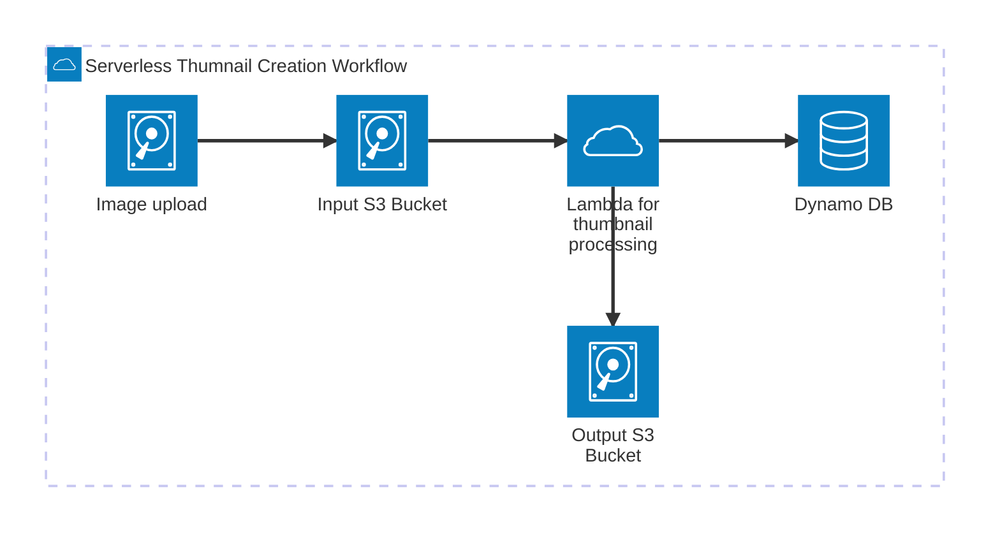
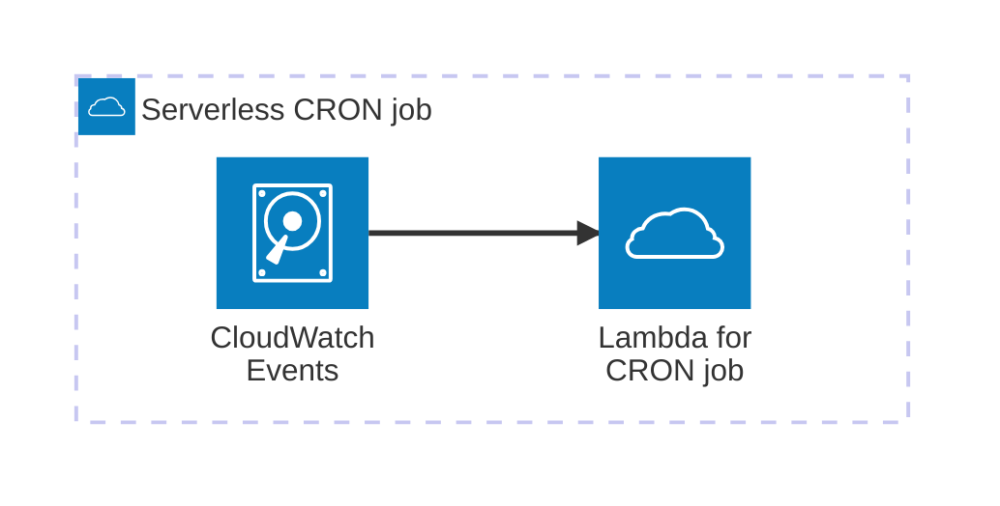
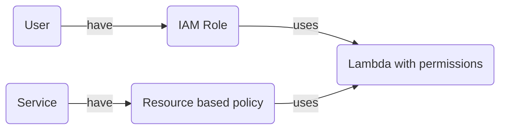
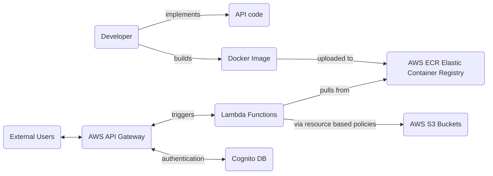
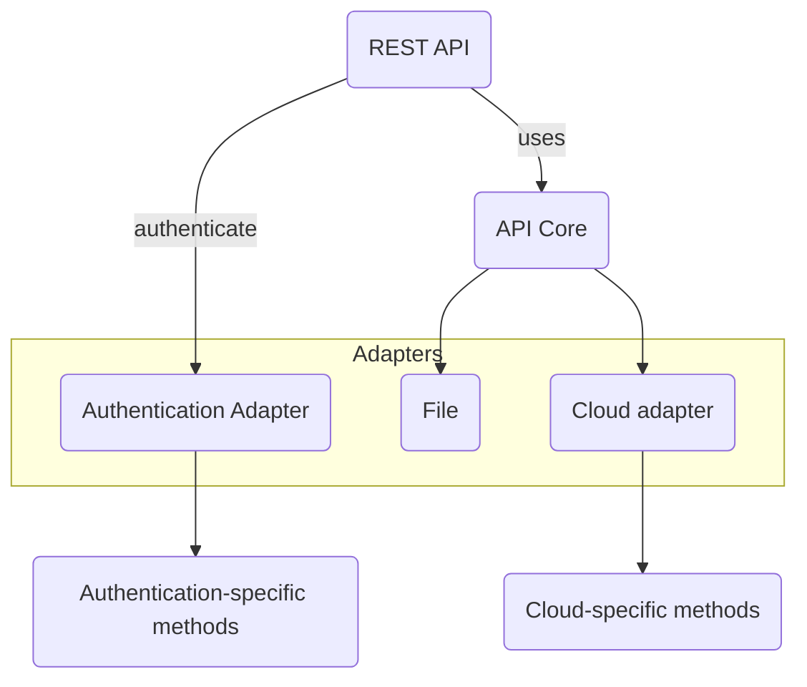
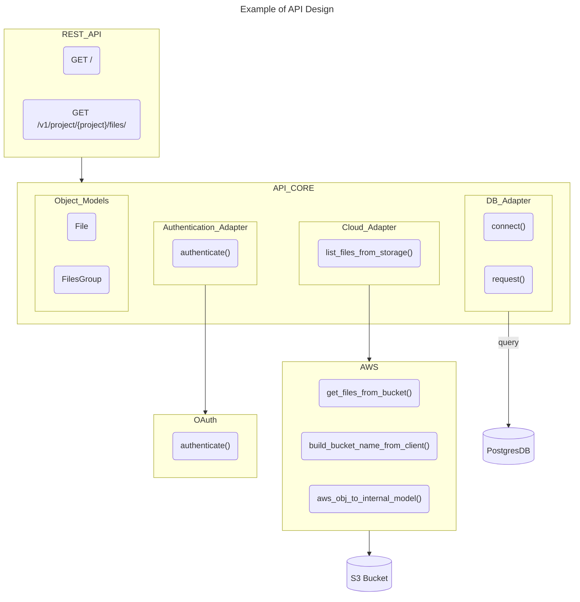
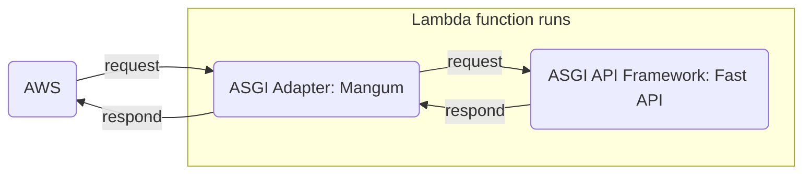
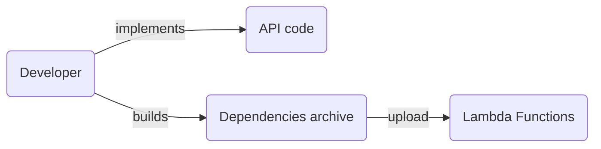
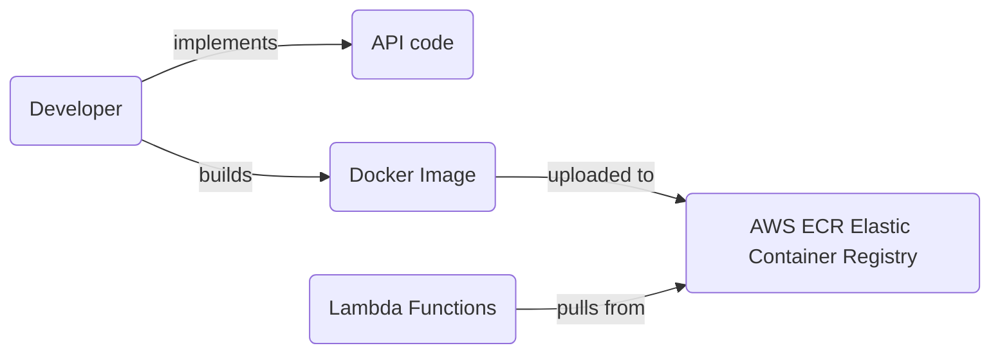
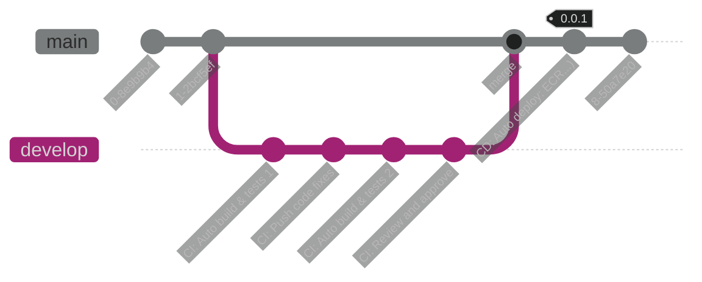

# AWS

## Command Line Interface

!!! cite "Documentation"

    - [AWS Command Line Interface (CLI)](https://awscli.amazonaws.com/v2/documentation/api/latest/index.html){target=_blank}
    - [What is the AWS Command Line Interface?](https://docs.aws.amazon.com/cli/latest/userguide/cli-chap-welcome.html){target=_blank}

!!! note "From AWS documentation"

    The AWS Command Line Interface (AWS CLI) is an open source tool that enables you to interact with AWS services using commands in your command-line shell.
    With minimal configuration, the AWS CLI enables you to start running commands that implement functionality equivalent to that provided by the browser-based AWS Management Console from the command prompt in your terminal program.

## AWS Serverless: Lambda

Serverless is a new paradigm in which developers don't have to manage servers anymore.

### Amazon EC2

- Are virtual servers in the cloud
- Have a fixed amount of RAM and CPU available
- Are continuously running
- Scaling means intervention to add or remove servers

### Lambda

- Are virtual functions: there is no server to manage
- Limited in time: the function is created and destroyed a short time after (~15 min)
- On demand
- Scaling is automated

!!! success "Benefits"

    - pay per request and compute time
    - integration with AWS services
    - integration with lots of programming languages
    - easy to get more resources per functions (up to 10 Gb per lambda)
    - increasing the amount of RAM also scales CPU and network
  
### Integration

- API Gateway: create a REST API and invoke lambda functions
- Kinesis: use lambdas to do data transformations on the fly
- Dynamo DB: create some triggers based on the database to launch lambdas
- S3: storage, can trigger lambdas on file creation
- Cloud Front
- CloudWatch Events EventBridge: react on events in the workflow pipeline
- CloudWatch Logs: to stream logs wherever needed
- SNS
- SQS
- Cognito: react to whenever a user logs into the database

#### Examples

##### Serverless thumbnail creation



##### Serverless CRON job



CloudWatch Events EventBridge
Triggers every one hour
Lambda function to perform a task

### Role and permissions (IAM Role)

Two cases here:

#### Lambda function is used by people

IAM Role grants Lambda functions permissions to AWS services and resources using policies.
A policy sets the access rights to each service for the lambda.
If someone wants to trigger a lambda function, then it needs to have an IAM role corresponding to the lambda.

#### Lambda functions is used by services

If the lambda is invoked by other services, then one can use **resource based policies** to give accounts and AWS services permission to use lambda resources.

#### Graph



#### Best practices

!!! tip "Best practice"

    Create one lambda execution role per function.

#### Lambda environment variables

Lambda function behaviors can be adjusted using environment variables, just as in regular code.
Each lambda has its own environment variables, that can be encrypted if needed.

#### Lambda and docker

AWS provides docker images for the Lambda function.
Once the Docker images created, amazon ECR can act as a docker registry to let the Lambda pull the image when needed.

## Deploying an API to AWS

### Resources

Youtube:

- [Deploy FastAPI on AWS Lambda | In 9 MINUTES](https://www.youtube.com/watch?v=7-CvGFJNE_o){target=_blank}
- [Deploy FastAPI on AWS Lambda ⚡ Serverless hosting!](https://youtu.be/RGIM4JfsSk0){target=_blank}

Amazon AWS:

- [Choose between REST APIs and HTTP APIs](https://docs.aws.amazon.com/apigateway/latest/developerguide/http-api-vs-rest.html){target=_blank}
- [Get started with API Gateway](https://docs.aws.amazon.com/apigateway/latest/developerguide/getting-started.html){target=_blank}
- [Get started with the REST API console](https://docs.aws.amazon.com/apigateway/latest/developerguide/getting-started-rest-new-console.html){target=_blank}

Udemy course:

- [Udemy AWS Certified Developer Associate 2025 DVA-CO2](https://www.udemy.com/share/101WgC3@pLgBaBuVrUYFqMfriz8lQwzF2miwPovRHr1GEFwTndjn1LOogJN-BIk4VYFXLys7CA==/){target=_blank}

### Overview



### Create the API with a framework of choice

!!! cite "Documentation"

    - [FastAPI Documentation](https://fastapi.tiangolo.com/)

The API is a bit of code that defines endpoints and exposes them (see [APIs notes](./../../api/api.md)).
It can be created using a framework with a specific language.
Before deploying the API to Amazon AWS, make sure that the API:

- is tested
- works locally
- uses adapters to reduce the impact of dependencies in the project

---



---



---

### Adapting ASGI requests to the Lambdas using an adapter

!!! cite "Documentation"

    - [Pypi mangum 0.19.0](https://pypi.org/project/mangum/){target=_blank}
    - [Mangum documentation](https://mangum.fastapiexpert.com/){target=_blank}
    - [ASGI - Asynchronous Server Gateway Interface - specification documentation](https://asgi.readthedocs.io/en/latest/){target=_blank}

Any api framework (FastAPI, Django, etc...) defines routes.
These routes uses the [ASGI specification](https://asgi.readthedocs.io/en/latest/){target=_blank}.
However, Lambdas from AWS does not use it and requires an adapter: `Mangum` for instance.



In a FastAPI code, it translates to:

1. Installing the library [Mangum](https://pypi.org/project/mangum/){target=_blank}
2. Adding a mangum handler:

```python

from fastapi import FastAPI
from mangum import Mangum               # first line to add

app = FastAPI()
handler = Mangum(app, lifespan="off")   # second line to add

@app.get("/")
def read_root():
    return {"Hello": "World"}

```

3. Specifying the handler variable in the Lambda configuration. If the handler variable is in `main.py`, then the target to set is `main.handler`. This is the entry point of the lambda.

### Instanciate a Lambda

#### Using a code archive

The most straight forward way to run a lambda is by giving it a small function.
If requirements are needed, for instance external libraries, then an archive must be provided to the Lambda.



#### Using a container image and ECR

!!! cite "Documentation"

    - [Create a Lambda function using a container image](https://docs.aws.amazon.com/lambda/latest/dg/images-create.html){target=_blank}
    - [AWS Lambda base images](https://gallery.ecr.aws/lambda/){target=_blank}
    - [How to package and deploy a Lambda function as a container image](https://dev.to/aws-builders/how-to-package-and-deploy-a-lambda-function-as-a-container-image-3d1a){target=_blank}
    - [Creating a container image for use on Amazon ECS](https://docs.aws.amazon.com/AmazonECS/latest/developerguide/create-container-image.html){target=_blank}
    - [DockerHub amazon/aws-lambda-python](https://hub.docker.com/r/amazon/aws-lambda-python)

A more suited workflow would be to setup a Docker image for the API project.
Then upload the workflow to Elastic Container Registry (ECR).
Finally, when creating the Lambda, specify the image to use.
Updated container image is automatically used by the Lambda at instanciation.



##### Build the docker file

Example of lambda image running python 3.13:

```txt
public.ecr.aws/lambda/python:3.13
```

Example of Dockerfile for a lambda:

```txt
FROM public.ecr.aws/lambda/python:3.13

COPY requirements.txt .

RUN pip install --no-cache-dir -r requirements.txt

COPY . .

CMD ["path/to/main.py"]
```

##### Upload a docker image to the ECR

Authenticate the docker client for AWS:

```bash
aws ecr get-login-password --region eu-west-3 | docker login --username AWS --password-stdin 285647635452.dkr.ecr.eu-west-3.amazonaws.com
```

Then, build the image:

```bash
docker build -t <ecr_name> -f Dockerfile .
```

Tag the image:

```bash
docker tag <ecr_name>:latest 285647635452.dkr.ecr.eu-west-3.amazonaws.com/<ecr_name>:latest
```

```bash
docker push 285647635452.dkr.ecr.eu-west-3.amazonaws.com/<ecr_name>:latest
```

### Let the lambda access a bucket

!!! cite "Documentation"

    - [How do I allow my Lambda function access to my Amazon S3 bucket?](https://repost.aws/knowledge-center/lambda-execution-role-s3-bucket){target=_blank}
    - [Week-8:Configure AWS Lambda with a Docker Image and Invoke via API](https://medium.com/@mzeynali01/week-8-configure-aws-lambda-with-a-docker-image-and-invoke-via-api-575253634b27){target=_blank}

If the needed data is stored inside a bucket, then the lambda should have access to it.
For this, one can configure ressource based permissions.

### Let the lambda use a database

### Let the lambda trigger on HTTP request using an API gateway

### Let the API generate some logs

### Automate Lambda Deployment with GitHub Actions

Example from [this article](https://medium.com/@mzeynali01/week-8-configure-aws-lambda-with-a-docker-image-and-invoke-via-api-575253634b27){target=_blank}:

- Use AWS credentials as GitHub secrets
- Deploy on push to the main branch

```txt
name: Deploy to AWS Lambda

on:
  push:
    branches:
      - main
jobs:
  deploy:
    runs-on: ubuntu-latest
    steps:
      - name: Checkout Code
        uses: actions/checkout@v2
      
      - name: Set up Docker
        run: |
          docker --version
      
      - name: Log in to ECR
        run: |
          aws ecr get-login-password --region <region> | docker login --username AWS --password-stdin <aws-account-id>.dkr.ecr.<region>.amazonaws.com
      
      - name: Build Docker Image
        run: |
          docker build -t my-lambda-container .
      
      - name: Tag and Push Image to ECR
        run: |
          docker tag my-lambda-container:latest <aws-account-id>.dkr.ecr.<region>.amazonaws.com/my-lambda-container:latest
          docker push <aws-account-id>.dkr.ecr.<region>.amazonaws.com/my-lambda-container:latest
      - name: Update Lambda Function
        run: |
          aws lambda update-function-code --function-name my-lambda-function --image-uri <aws-account-id>.dkr.ecr.<region>.amazonaws.com/my-lambda-container:latest
```


