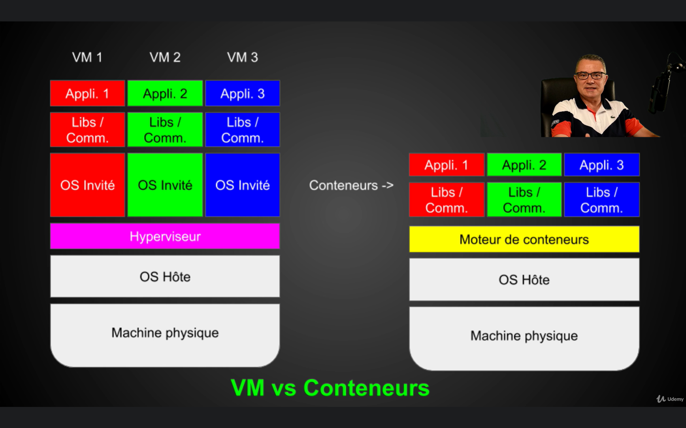

# Docker

!!! info

    Docker is a [virtualization](https://en.wikipedia.org/wiki/Virtualization){target=_blank} technique based on containers.
    It allows running very light and isolated containers.

On Windows, docker uses the Hyper-V virtualization.

!!! quote

    - [Develop inside a container using VSCode](https://code.visualstudio.com/docs/devcontainers/containers){target=_blank}
    - [Docker documentation](https://docs.docker.com/){target=_blank}
    - [Docker Hub](https://hub.docker.com/){target=_blank}
    - [Play with Docker](https://labs.play-with-docker.com/)[target=_blank]

## Preliminaries

### Virtualization

!!! info
    Virtualization is the emulation of a physical computer using a software called hypervisor.
    It allows to run multiple virtual computers on the same physical computer.
    The operating system (OS) already runs on a virtual computer, and have no way to make the difference between a physical and a virtual computer.

    

### Virtual Machine (VM)

VMs are base on [virtualization](#virtualization).

!!! success "Benefits of VMs"

    - Low hardware cost
    - Ease of installation
    - Installation speed

!!! error "Drawbacks of VMs"

    Needs:

    - An OS
    - Its libraries
    - Its commands
    - Its dedicated ressources

Some VMs requires an OS on host machine:

- VMWare (paid)
- Virtualbox
- QEMU
- Virtual Server (paid)

Some hypervisors do not require any OS to be installed on host machine (Bare Metal VMs):

- Xen
- VMWare ESX (paid)
- Hyper-V (commercial)
- Linux KVM

Main VM cloud hosts are:

- AWS (Amazon)
- Azure (MS)
- Digital Ocean

### Containers

!!! info "What is a container?"

     Containers are lightweight, standalone, and executable packages that include everything needed to run a piece of software, such as the code, runtime, system tools, libraries, and settings. 
     They ensure that software runs consistently across different computing environments by isolating the application from its surroundings.



!!! success "Benefits of containers"

    - Low CPU, RAM and disk usage
    - More containers can be created given the low ressource usage
    - Even lower hardware cost compared to VMs
    - Very fast deployment and startup

Containers are based on containers engines and also runs on a host machine.
The main difference between containers and VMs is that a container is a process of the host machine, making it completely isolated from it.

### Image

A container is created using an image.

Using Oriented Object Programming the container would be the class and the image would be an instance of this class.

An image is defined by its tag: it is fixed.
On the other hand, the container is dynamic and can be used from this fixed image.

### Layers

An image is made from layers.
Layers can be added or removed so that the image is relevant for our usage.

## Docker hub

[Docker Hub](https://hub.docker.com/){target=_blank} is the equivalent of GitHub.
It stores Docker images from the community.

!!! danger "Use verified and popular images!"

    Everyone can upload images to Docker hub.
    Some can have security issues or may contain malwares.

## Installation

Cf [official Docker documentation](https://docs.docker.com/){target=_blank}.

## Docker Basics

One can fist analyze the following command:

```bash title="Example: how to call Docker:"
docker run --rm bash echo Salut!
```

It gives the follwing result:

```text
Unable to find image 'bash:latest' locally
latest: Pulling from library/bash
e1517fbc9c07: Download complete
467989b961c3: Download complete
43c4264eed91: Download complete
Digest: sha256:ce062497c248eb1cf4d32927f8c1780cce158d3ed0658c586a5be7308d583cbb
Status: Downloaded newer image for bash:latest
Salut!
```

What happens is:

1. Docker searches for a bash image and since we did not specified any tag, it takes the latest version.
2. Docker pulls (downloads) bash image from DockerHub.
3. Docker executes the command `echo Salut!`.
4. Docker removes the container (not the image) since we used the flag `-rm`.

### View downloaded (cached) images

```bash title="Listing cached images:"
docker images
```

```text title="Result:"
REPOSITORY   TAG       IMAGE ID       CREATED       SIZE
bash         latest    ce062497c248   6 weeks ago   21.8MB
```

After having launched a bash container, bash image is cached in the computer.
Caching ensures that the following runs are much faster: there is no need to download the image again.

Running again:

```bash title="Specifying an image version / tag:"
docker run --rm bash:3.2 echo Salut!
```

```text title="Result:"
REPOSITORY   TAG       IMAGE ID       CREATED       SIZE
bash         latest    ce062497c248   6 weeks ago   21.8MB
bash         3.2       79dd16db958d   5 months ago   17.4MB
```

Again, this is the goal of caching: the bash version 3.2 have to be dowloaded and appears in the table.

### Running interactive Docker

- `-t`: asks Docker to give a terminal access, plugging STDIN and STDOUT
- `-i`: runs the container in interactive mode, giving access to the keyboard
- `-ti`: combination of `-t` and `-i`

```bash title="After this command, Docker terminal appears inside out terminal:"
docker run -ti --rm bash:3.2 echo Salut!
```

```bash title="To exit the docker container console:"
exit
```

### List container information

```bash title="To print instanciated image info (containers) from inside the container:"
docker ps
```

### IDs

Image and containers have unique IDs, that can be obtained using `docker images`.
IDs can be used to:

- get images properties
- manipulate images

### Print history / layers of an image

```bash title="Print the layers used for a given image:"
docker history <IMAGE_ID>
```

!!! tip "Typing only the first unique digits of the ID is the same as copy-pasting the whole ID."

TO BE CONTINUED...
