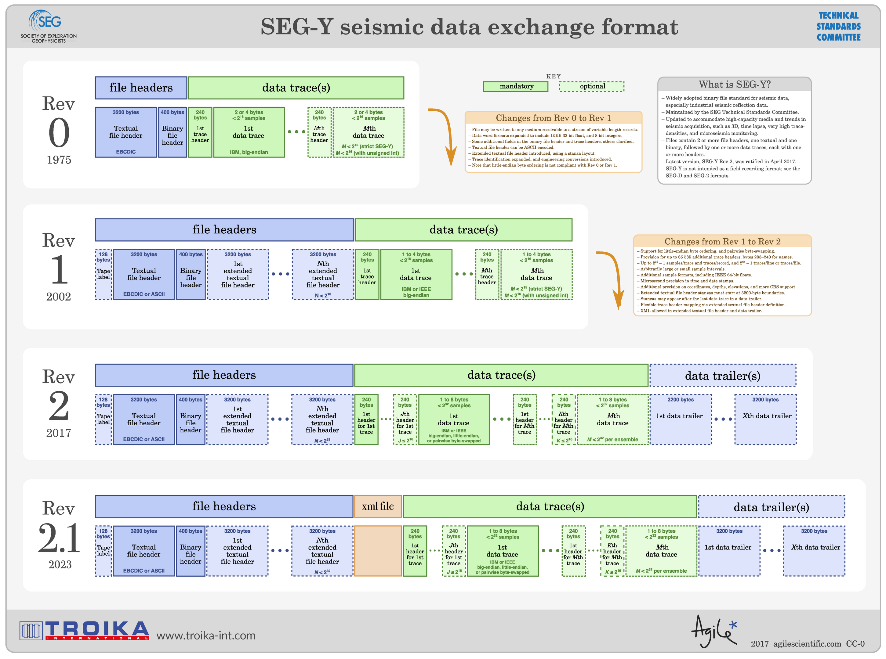

# SEGY

!!! info

    The SEGY (Shot and Common Envelopes with GY data) file format is a standard used in the oil and gas exploration industry to store and exchange seismic data. SEGY files contain data acquired through the process of seismic reflection, which involves sending acoustic waves into the Earth's subsurface and recording the reflections of these waves to create images of the subsurface structure.
    
!!! quote

    - [SEG Wiki](https://wiki.seg.org/wiki/SEG-Y){target=_blank}

Key features of the SEGY file format include:

1. **Binary Format:** SEGY files are binary files that store seismic data in a structured manner. The binary data represents seismic traces, each of which corresponds to a recorded reflection.

2. **Header Information:** SEGY files have a series of textual and binary headers that precede the actual seismic data. These headers contain metadata information such as survey parameters, acquisition details, and other relevant information about the seismic data.

3. **Trace Data:** The bulk of the SEGY file consists of seismic trace data. Each trace represents a recorded seismic signal at a particular location and time. The trace data is usually stored as a series of numeric values representing the amplitude of the reflected waves.

4. **Trace Headers:** Along with trace data, SEGY files include trace headers containing additional information specific to each seismic trace. This information may include details such as trace number, source-receiver distance, and timing information.

5. **Standardized Specifications:** The SEGY file format is governed by industry standards, and its specifications are maintained by organizations such as the Society of Exploration Geophysicists (SEG). This standardization ensures that SEGY files can be exchanged and interpreted consistently across different seismic data processing and interpretation systems.

SEGY files are widely used in the oil and gas exploration industry for storing and exchanging seismic data collected during exploration activities. The format has been in use for several decades and has become a de facto standard for seismic data interchange. The binary nature of SEGY files makes them efficient for storing large volumes of seismic data, and the standardized headers facilitate interoperability between different seismic data processing software and systems.
